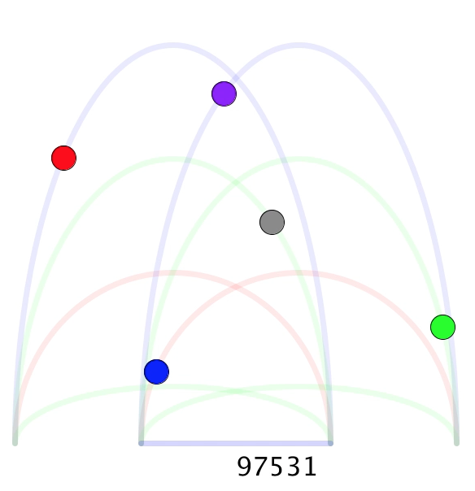
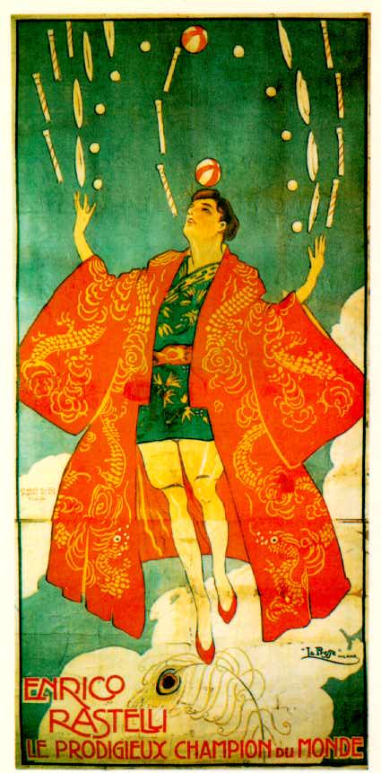
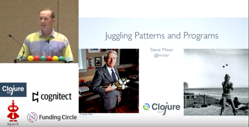

# Rastelli
Rastelli juggles with Clojure

```
(require '[miner.rastelli.animate :as a])

(a/animate 97531)
```

[](sample#sample-animation)

[](https://en.wikipedia.org/wiki/Enrico_Rastelli)


# Juggling Patterns and Programs
Presented at Clojure/conj, December 2016

[](https://www.youtube.com/watch?v=TqG176T69VM)

[slides](https://speakerdeck.com/miner/juggling-patterns-and-programs)

[video](https://www.youtube.com/watch?v=TqG176T69VM)


## Copyright and License

Copyright (c) 2016 Stephen E. Miner.

Distributed under the Eclipse Public License, the same as Clojure.
